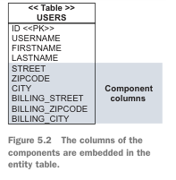

# Resumo do Livro "Java Persistence with Hibernate" (2ª Edição) por Christian Bauer, Gavin King, Gary Gregory

## 1 Entendendo objetos/relacional e persistência

### 1.1 O que é Persistência?

Persistência é o processo de salvar os dados de forma que os mesmos possam ser recuperados futuramente pela aplicação, mesmo em caso de desligamento da aplicação, ou seja, os dados são salvos fisicamente e não apenas em memória. Em Java, a persistência pode ser caracterizada pelos mapeamentos entre entidades, relações e objetos.

#### 1.1.1 Banco de Dados Relacional

É uma abordagem flexível e robusta para solução de banco de dados, além de ter diversas pesquisas que embasam e garantem aspectos como segurança e integridade das informações. Vale ressaltar que os bancos de dados relacionais têm uma importante característica chamada independência de dados, em que a base de dados não depende da aplicação, o que é um fato importante já que os dados normalmente são válidos bem mais tempo que a aplicação. Os bancos de dados relacionais não estão associados a uma linguagem de programação específica.

#### 1.1.2 Entendendo SQL

Esta seção basicamente é uma breve introdução a SQL, introduzindo conceitos como DDL, DML e suas principais cláusulas.

#### 1.1.3 Usando SQL no Java

Esta seção discute a interação entre aplicações Java e bancos de dados SQL através da API JDBC, destacando as tarefas de baixo nível envolvidas no acesso a dados e como isso pode ser tedioso para os engenheiros de aplicação. Ela questiona se o modelo de dados relacional e o SQL são as escolhas certas para a persistência em aplicações orientadas a objetos, respondendo afirmativamente devido à dominância e comprovada eficácia dos bancos de dados SQL na indústria. No entanto, reconhece que há cenários, especialmente em sistemas distribuídos em larga escala, que podem necessitar de abordagens diferentes para o gerenciamento de dados. A seção também aborda a ideia de trabalhar com um modelo de domínio orientado a objetos em uma aplicação Java, em vez de interagir diretamente com os dados tabulares de um banco de dados, para melhorar a reutilização e manutenção do código, especialmente em aplicações com lógica de negócios não trivial. Ela menciona o desafio do descompasso de paradigma entre a modelagem orientada a objetos e a modelagem relacional, e sugere uma exploração mais aprofundada desse descompasso para entender os problemas associados.

### 1.2 Descompasso de Paradigma

Iniciamos os estudos dos mapeamentos de entidades com seu modelo de dados.

```java
public class User {
    String username;
    String address;
    Set billingDetails;
// Accessor methods (getter/setter), business methods, etc.
}
public class BillingDetails {
    String account;
    String bankname;
    User user;
// Accessor methods (getter/setter), business methods, etc.
}
```

```sql
create table USERS (
    USERNAME varchar(15) not null primary key,
    ADDRESS varchar(255) not null
);
create table BILLINGDETAILS (
    ACCOUNT varchar(15) not null primary key,
    BANKNAME varchar(255) not null,
    USERNAME varchar(15) not null,
    foreign key (USERNAME) references USERS
);
 ```

#### 1.2.1 Problema com Granularidade

O descompasso entre o paradigma objeto/relacional é evidenciado em vários aspectos. Inicialmente, o endereço pode ser considerado uma string, no entanto, decidimos que a maneira mais prática é transformar o endereço em um objeto que contém os atributos relacionados ao endereço. A solução pragmática muitas vezes adotada é a de adicionar várias colunas de tipos de dados definidos pelo fornecedor na tabela USERS, o que reflete uma representação menos flexível e mais "achatada" dos dados, em contraste com o modelo orientado a objetos mais rico e granular. Este descompasso de granularidade é apenas um dos muitos desafios enfrentados ao tentar mapear entre o modelo de domínio orientado a objetos e o modelo relacional, e é um exemplo de como o descompasso entre os paradigmas objeto/relacional pode manifestar-se na prática.

#### 1.2.2 Problemas com Subtipos

Essa seção faz um breve discurso sobre herança e seu comportamento no banco de dados.

#### 1.2.3 Problemas com Objetos Idênticos

Essa seção nos traz insights sobre o comportamento de certos atributos que precisam ter sua validação em banco, como no caso do `USERNAME`. Além disso, idealmente, as entidades devem ter um identificador que normalmente precisa ser gerado pelo próprio sistema.

#### 1.2.4 Problemas Relacionados a Associações

Essa seção mostra como seriam os relacionamentos de associações entre as classes no modelo de dados.

#### 1.2.5 Problema Relacionado à Navegação de Dados

Essa seção exemplifica uma situação em que objetos podem ser gigantescos, causando problemas de memória. Uma forma de contornar esse problema é com lazy loading, assim podemos evitar o famoso problema de n+1 consultas e buscamos a lista de dados apenas se necessitarmos do mesmo.

### 1.3 ORM e JPA

Essa seção introduz o conceito de ORM em projetos Java, com alguns dos benefícios citados:

* Produtividade
* Manutenção
* Performance
* Independência do gerenciador do banco de dados

#### 1.3.1 JPA

* Uma facilidade para especificar metadados de mapeamento.
* APIs para realizar operações CRUD básicas em instâncias de classes persistentes, mais proeminentemente `javax.persistence`.
* Uma linguagem e APIs para especificar consultas que se referem a classes e propriedades de classes.
* Como o mecanismo de persistência interage com instâncias transacionais para realizar verificação de sujeira, busca de associação e outras funções de otimização.

## 2.0 Estrategias de mapeamento

Neste capítulo, colocamos a mão na massa e começamos a usar o Hibernate para mapear nossas entidades e trabalhar com elas. Como meu foco é entender melhor o Hibernate para trabalhar com o Spring Boot, algumas coisas foram simplificadas, mas o comportamento continua o mesmo!

## Mapeando Entidades

* `@Entity`: Anotação para identificar que uma classe é uma entidade no banco de dados.
* `@Id`: Mapeando uma coluna que é o identificador único da tabela.
* `@GeneratedValue`: Geração do ID.

## Buscando e Atualizando Dados Gerenciando a Nossa Própria Sessão

* **EntityManager**:
   O `EntityManager` é uma interface fundamental no Java Persistence API (JPA), que é uma especificação padrão de Java para mapeamento objeto-relacional e gerenciamento de persistência. O `EntityManager` é responsável por gerenciar o ciclo de vida das entidades, o que inclui operações de persistência básicas como criar, ler, atualizar e excluir (CRUD), bem como outras operações de gerenciamento de transações e persistência.

``` java
    @Transactional
    public void save(BaseModel entity) {
        if (entity.getId() == null) {
            entityManager.persist(entity);
        } else {
            entityManager.merge(entity);
        }
    }

    @Transactional(readOnly = true)
    public List<Menssage> findAllMenssage() {
        return entityManager.createQuery("select m from Menssage m", Menssage.class).getResultList();
    }

```

## 3 modelo de dominio e metadados

### 3.1 Arquirtetura em camadas

* Presentation layer - Camada responsavel por envia  os dados para a apresentação, isso é nossas camada de controladores do spring
* Business layer - camada que cotêm as regras de negocio, pode ser visto como os services no spring-boot
* Persistence layer - pode ser nossos daos/ repositores, camada de persistencia de dados
* Database - no spring-boot normalmente esse cara é configuração do proprities
* Helper and utility classes - class auxiliares como constantes, exceções e outros .


### 3.2 - Implementando o modelo de domínio

Esta seção oferece uma visão mais detalhada sobre as classes e seu comportamento com o Hibernate, como associações:

* Metadados baseados em anotações - como `org.hibernate.annotations.Cache`, ou GLOBAL ANNOTATION METADATA, `@Future`
* Aplicando regras de validação Bean - `@NotNull` `@Size`
* A persistência transparente é importante se você deseja executar e testar seus objetos de negócios de maneira independente e fácil.
* Melhores práticas e requisitos para o modelo de programação POJO (Plain Old Java Object) e entidade JPA, e quais conceitos eles têm em comum com a antiga especificação JavaBean.
* Mapeamentos mais complexos, possivelmente com uma combinação de anotações JDK ou arquivos de mapeamento JPA/Hibernate XML.

```java
public class Bid {
   //associação
    protected Item item;

    public Item getItem() {
        return item;
    }
    public void setItem(Item item) {
        this.item = item;
    }

    public void addBid(Bid bid) {
        if (bid == null) throw new NullPointerException("Can't add null Bid"); // defensive
        if (bid.getItem() != null) throw new IllegalStateException("Bid is already assigned to an Item") // defensive;
        getBids().add(bid);
        bid.setItem(this);
    }
}

public class Item {
    protected Set<Bid> bids = new HashSet<Bid>();
    public Set<Bid> getBids() {
        return bids;
    }
    //associação
    public void setBids(Set<Bid> bids) {
        this.bids = bids;
    }
}
```

## 4 - Mapeamento e Persistência das Classes

Nos modelos conceituais existem duas formas de mapeamentos, podemos entender que no caso de duas pessoas morarem na mesma casa existe apenas 1 endereço vinculado, ou um mapeamento em que um endereço está estritamente ligado a um usuário havendo 1 endereço para cada usuário.

* Você pode recuperar uma instância de tipo de entidade usando sua identidade persistente: por exemplo, uma instância de Usuário, Item ou Categoria.
* Uma instância de tipo de valor não tem propriedade de identificador persistente; pertence a uma instância de entidade. Sua vida útil está vinculada à instância de entidade proprietária.


O diagrama do seu modelo de domínio e implemente POJOs para todas as entidades e tipos de valor. Você terá que cuidar de três coisas:

* Referências compartilhadas - Evite referências compartilhadas para instâncias de tipo de valor quando escrever suas classes POJO. Por exemplo, certifique-se de que apenas um Usuário pode referenciar um Endereço. Você pode tornar o Endereço imutável sem um método público `setUser()` e impor o relacionamento com um construtor público que tem um argumento de Usuário. Claro, você ainda precisa de um construtor sem argumentos, provavelmente protegido, como discutimos no capítulo anterior, para que o Hibernate também possa criar uma instância.

* Dependências de ciclo de vida - Se um Usuário for excluído, sua dependência de Endereço também deve ser excluída. Os metadados de persistência incluirão as regras de cascata para todas essas dependências, para que o Hibernate (ou o banco de dados) possa cuidar da remoção do Endereço obsoleto. Você deve projetar seus procedimentos de aplicativo e interface de usuário para respeitar e esperar tais dependências - escreva seus POJOs de modelo de domínio de acordo.

* Identidade - As classes de entidade precisam de uma propriedade de identificador em quase todos os casos. As classes de tipo de valor (e, claro, classes JDK como String e Integer) não têm uma propriedade de identificador, porque as instâncias são identificadas através da entidade proprietária.
  


A persistência complica esse cenário. Com a persistência objeto/relacional, uma instância persistente é uma representação em memória de uma determinada linha (ou linhas) de uma tabela de banco de dados (ou tabelas). Juntamente com a identidade e igualdade Java, definimos a identidade do banco de dados. Agora você tem três métodos para distinguir referências:

* Objetos são idênticos se ocuparem o mesmo local de memória na JVM. Isso pode ser verificado com o operador `a == b`. Este conceito é conhecido como identidade de objeto.
* Objetos são iguais se tiverem o mesmo estado, conforme definido pelo método `a.equals(Object b)`. Classes que não sobrescrevem explicitamente este método herdam a implementação definida por `java.lang.Object`, que compara a identidade do objeto com `==`. Este conceito é conhecido como igualdade de objeto.
* Objetos armazenados em um banco de dados relacional são idênticos se compartilharem a mesma tabela e valor de chave primária. Este conceito, mapeado no espaço Java, é conhecido como identidade de banco de dados.

O identificador de banco de dados de uma entidade é mapeado para alguma chave primária de tabela, então vamos primeiro obter algum conhecimento sobre chaves primárias sem nos preocuparmos com mapeamentos. Dê um passo atrás e pense sobre como você identifica entidades.

Uma chave candidata é uma coluna ou conjunto de colunas que você poderia usar para identificar uma linha particular em uma tabela. Para se tornar a chave primária, uma chave candidata deve satisfazer os seguintes requisitos:

* O valor de qualquer coluna de chave candidata nunca é nulo. Você não pode identificar algo com dados que são desconhecidos, e não há nulos no modelo relacional. Alguns produtos SQL permitem definir chaves primárias (compostas) com colunas anuláveis, então você deve ter cuidado.
* O valor da(s) coluna(s) da chave candidata é um valor único para qualquer linha.
* O valor da(s) coluna(s) da chave candidata nunca muda; é imutável.

É possível mapear na própria anotação `@Entity(name = "message")` o nome da tabela.

Para desativar a geração de instruções INSERT e UPDATE na inicialização, você precisa de anotações nativas do Hibernate:
Ao habilitar inserções e atualizações dinâmicas, você diz ao Hibernate para produzir as strings SQL quando necessário, não antecipadamente. O UPDATE conterá apenas colunas com valores atualizados, e o INSERT conterá apenas colunas não nulas.
`DynamicInsert` e `DynamicUpdate`

Podemos marcar a entidade como imutável `Immutable`.

## 5 - Mapeando Valores e Tipos

### 5.1 - Quando você mapeia uma classe persistente, seja ela uma entidade ou um tipo incorporável (mais sobre isso mais tarde, na seção 5.2), todas as suas propriedades são consideradas persistentes por padrão. As regras padrão do JPA para propriedades de classes persistentes são as seguintes

* O Hibernate carrega e armazena o valor da propriedade em uma coluna com um tipo SQL apropriado e o mesmo nome da propriedade.
* Se você anotar a classe da propriedade como `@Embeddable`, ou mapear a propriedade em si como `@Embedded`, o Hibernate mapeia a propriedade como um componente incorporado da classe proprietária.
* Caso contrário, se o tipo da propriedade for `java.io.Serializable`, seu valor é armazenado em sua forma serializada. Isso normalmente não é o que você deseja, e você deve sempre mapear classes Java em vez de armazenar um monte de bytes no banco de dados.
* Caso contrário, o Hibernate lançará uma exceção na inicialização, reclamando que não entende o tipo da propriedade.

### 5.1.1 - Sobrescrevendo Padrões Básicos de Propriedades

* Você pode não querer que todas as propriedades de uma classe de entidade sejam persistentes. `@Transient`
* Se você quer declarar como opcional um atributo no banco de dados, utilize `@Basic(optional = false)`. Normalmente, os desenvolvedores utilizam o `@Column` em vez do `@Basic` para definir a nulidade da coluna, como mostrado abaixo:

  ```java
  @Column(nullable = false)
  BigDecimal initialPrice;```

### 5.1.2

Para que o @Access(AccessType.PROPERTY) funcione corretamente, você precisará ter métodos getter e setter definidos para a propriedade name na sua classe. Aqui está um exemplo de como a classe completa poderia parecer:

```java
@Entity
public class Item {

    @Access(AccessType.PROPERTY)
    @Column(name = "ITEM_NAME")
    protected String name;

    public String getName() {
        return name;
    }

    public void setName(String name) {
        this.name = name;
    }

    // ... restante do código ...
}

```

Neste exemplo, mesmo que a anotação @Column esteja associada ao campo name, devido à anotação @Access(AccessType.PROPERTY), o Hibernate irá procurar e usar os métodos getName() e setName(String) para acessar e modificar o valor do campo name. Isso permite que você tenha lógica adicional nos métodos getter e setter, se necessário, que será executada sempre que o Hibernate acessar ou modificar o valor da propriedade name.

### 5.1.3 - Usando propriedades derivadas

A anotação @org.hibernate.annotations.Formula no Hibernate é usada para calcular um valor de uma propriedade com base em uma expressão SQL, como você mostrou no exemplo. Essa expressão é avaliada pelo banco de dados sempre que a entidade é recuperada, e o valor calculado é então atribuído à propriedade na entidade.

Aqui estão alguns pontos importantes sobre como a anotação @Formula funciona, especialmente em relação a operações de INSERT e UPDATE:

* Sem Persistência:A propriedade anotada com @Formula não é persistente, o que significa que ela não é armazenada no banco de dados como uma coluna regular.
* Apenas para SELECT:A anotação @Formula é usada apenas durante operações de SELECT. Quando o Hibernate recupera a entidade do banco de dados, ele inclui a expressão SQL da fórmula na cláusula SELECT, e o banco de dados avalia essa expressão para calcular o valor da propriedade.
* Valor Atualizado:O valor da propriedade derivada é atualizado apenas quando a entidade é recuperada do banco de dados. Se outros dados no banco de dados mudarem (por exemplo, se novas linhas forem adicionadas à tabela BID), o valor da propriedade derivada não será atualizado automaticamente. Você precisará recarregar a entidade para obter o valor atualizado.
  
```java
@org.hibernate.annotations.Formula(
"(select avg(b.AMOUNT) from BID b where b.ITEM_ID = ID)"
)
protected BigDecimal averageBidAmount;
```

### 5.1.4 - transformado conlunas em valores

 A anotação @ColumnTransformer no Hibernate permite que você especifique expressões SQL para converter o valor da coluna do banco de dados ao ler e escrever. Isso é útil quando o formato ou a unidade de medida usada no banco de dados é diferente do formato ou unidade de medida usada na aplicação.

No exemplo fornecido anteriormente, a expressão IMPERIALWEIGHT / 2.20462 é usada para converter o peso de libras para quilogramas ao ler do banco de dados, e a expressão ? * 2.20462 é usada para converter o peso de volta para libras ao escrever no banco de dados. O símbolo ? é um espaço reservado para o valor que está sendo escrito no banco de dados.

```java
@Entity
@Table(name = "ITEM")
public class Item {

    @Id
    @GeneratedValue
    private Long id;

    @ColumnTransformer(
        read = "IMPERIALWEIGHT / 2.20462",
        write = "? * 2.20462"
    )
    @Column(name = "IMPERIALWEIGHT")
    private double metricWeight;

    // ... restante do código ...
}

```

### 5.1.5 - Valores Gerados e Padrão de Propriedades

A anotação @org.hibernate.annotations.Generated no Hibernate é utilizada para marcar propriedades cujos valores são gerados pelo banco de dados, seja durante a inserção ou atualização de registros. As configurações de GenerationTime, como ALWAYS e INSERT, determinam quando o Hibernate deve buscar os valores gerados - após cada operação de inserção/atualização ou apenas após inserções. Para valores padrão, a anotação @ColumnDefault pode ser utilizada para definir um valor padrão durante a criação do esquema SQL.

```java
@Entity
@Table(name = "ITEM")
public class Item {

    @Id
    @GeneratedValue
    private Long id;

    @ColumnDefault("100")
    @Column(name = "PRICE")
    private BigDecimal price;

    @Generated(GenerationTime.INSERT)
    @Column(name = "CREATION_TIMESTAMP", insertable = false, updatable = false)
    private Timestamp creationTimestamp;

    // ... restante do código ...
}
```

### 5.1.6 - Propriedades temporais

A especificação JPA exige a anotação de propriedades temporais com @Temporal para definir a precisão do tipo de dados SQL da coluna mapeada. O Hibernate, além de suportar tipos temporais Java padrão, também aceita classes do pacote java.time do JDK 8. Uma funcionalidade útil é a anotação @CreationTimestamp, que instrui o Hibernate a atribuir o momento atual como valor da propriedade ao inserir uma nova entidade no banco de dados, facilitando o rastreamento do momento de criação de registros. Similarmente, a anotação @UpdateTimestamp pode ser utilizada para rastrear a última modificação. Além disso, o Hibernate oferece flexibilidade para criar e configurar geradores de valores personalizados, permitindo a automação de atribuições de valores tanto no lado da aplicação quanto no banco de dados.
com a introdução do Java 8, a nova API de Data e Hora (java.time) foi introduzida, e frameworks modernos como Spring Boot e Hibernate agora têm suporte nativo para esses tipos. Portanto, você não precisa mais usar a anotação @Temporal quando está mapeando campos de data e hora usando esses novos tipos. Por exemplo, você pode ter um campo LocalDate, LocalDateTime, Instant, etc., em sua entidade, e o Hibernate será capaz de mapear isso corretamente para o tipo de coluna de data e hora correspondente no banco de dados sem a necessidade de anotações adicionais.

```java
@Entity
@Table(name = "ITEM")
public class Item {

    @Id
    @GeneratedValue
    private Long id;

    @Temporal(TemporalType.TIMESTAMP)
    @CreationTimestamp
    @Column(name = "CREATION_TIMESTAMP", updatable = false)
    private Date creationTimestamp;

    // ... restante do código ...
}

```

### 5.1.7 - Mapeando enun

A anotação @Enumerated no Hibernate é utilizada para mapear tipos enumerados em Java, permitindo que sejam armazenados no banco de dados de forma mais legível ou eficiente. Por padrão, sem a anotação @Enumerated, o Hibernate armazena a posição ordinal do valor enum, o que pode ser problemático se o enum for alterado no futuro. Para evitar isso, a opção EnumType.STRING pode ser usada com a anotação @Enumerated, instruindo o Hibernate a armazenar o rótulo do valor enum, tornando o mapeamento mais robusto a mudanças e mais legível no banco de dados. Este mapeamento é crucial para garantir que os dados sejam armazenados de forma consistente e compreensível, facilitando a manutenção e compreensão do modelo de domínio.

```java
@Entity
@Table(name = "AUCTION")
public class Auction {

    @Id
    @GeneratedValue
    private Long id;

    @Enumerated(EnumType.STRING)
    @Column(name = "AUCTION_TYPE")
    private AuctionType auctionType;

    // ... restante do código ...
}

public enum AuctionType {
    HIGHEST_BID,
    LOWEST_BID,
    FIXED_PRICE
}

```

### 5.2 - Mapeando entre entidades

a modelagem de objetos, onde classes como "User" e "Address" estão associadas através de uma relação de composição. Nessa relação, o ciclo de vida de "Address" é totalmente dependente do ciclo de vida de "User". Esta associação, sendo uma forma forte de agregação, sugere que "Address" pode ser um tipo de valor candidato no mapeamento objeto/relacional, indicando uma estratégia para representar essas classes e relações em um banco de dados.


### 5.2.1 - esquemas no banco de dados

o mapeamento de uma relação de composição entre as classes "User" e "Address" em um esquema SQL, com "Address" sendo tratado como um tipo de valor, similar a String ou BigDecimal, e "User" como uma entidade. No esquema, todos os detalhes de um usuário e seus endereços são armazenados em uma única linha na tabela USERS. Se outra entidade, como "Shipment", referencia um "Address", a tabela SHIPMENT também incluirá colunas para armazenar um "Address". A chave primária de "Address" é a identificação da entidade proprietária no banco de dados, refletindo que "Address" não tem identidade própria e seu ciclo de vida é dependente da entidade proprietária. Isso facilita o suporte do Hibernate a modelos de domínio mais refinados, permitindo mais classes do que tabelas no mapeamento, sem a necessidade de comandos SQL especiais para gerenciar o ciclo de vida dos componentes embutidos.



```java
// Classe de entidade User
@Entity
@Table(name = "USERS")
public class User {
    @Id
    @GeneratedValue(strategy = GenerationType.IDENTITY)
    private Long id;

    private String name;

    @Embedded
    @AttributeOverrides({
        @AttributeOverride(name = "street", column = @Column(name = "home_street")),
        @AttributeOverride(name = "city", column = @Column(name = "home_city")),
        @AttributeOverride(name = "state", column = @Column(name = "home_state")),
        @AttributeOverride(name = "zip", column = @Column(name = "home_zip"))
    })
    private Address homeAddress;

    @Embedded
    @AttributeOverrides({
        @AttributeOverride(name = "street", column = @Column(name = "billing_street")),
        @AttributeOverride(name = "city", column = @Column(name = "billing_city")),
        @AttributeOverride(name = "state", column = @Column(name = "billing_state")),
        @AttributeOverride(name = "zip", column = @Column(name = "billing_zip"))
    })
    private Address billingAddress;

    // Getters e Setters...
}

// Classe incorporável Address
@Embeddable
public class Address {
    private String street;
    private String city;
    private String state;
    private String zip;

    // Getters e Setters...
}

```

### 5.2.2 - marcando class como embutida

No texto discutido, a composição em Java é explorada no contexto do Hibernate, uma ferramenta de mapeamento objeto-relacional. Embora Java não tenha um conceito inerente de composição, o Hibernate oferece uma maneira de representar relações de composição através das anotações `@Embeddable` e `@Embedded`. Uma classe marcada como `@Embeddable` indica que ela pode ser incorporada em uma entidade, enquanto `@Embedded` é usado na entidade proprietária para indicar a incorporação.

Neste contexto, a classe `Address` é tratada como um tipo de valor, sem identidade única, e é incorporada na classe `User`. O mapeamento é configurado de tal forma que as propriedades de `Address` são mapeadas diretamente para colunas específicas na tabela `USERS` do banco de dados.

O texto também toca na estratégia de acesso - se é através de campos ou métodos getter/setter - que é herdada da entidade proprietária para o componente incorporado. Uma ressalva mencionada é a falta de uma representação elegante para referências nulas em um `Address`, o que pode levar a comportamentos contraintuitivos quando se trata de colunas nulas no banco de dados.

Por fim, é sugerido que os métodos `equals()` e `hashCode()` devem ser sobrescritos em `Address` para comparação de valor, o que é crucial ao lidar com coleções que dependem de comparações de igualdade, como `HashSet`.

```java
// Classe incorporável Address
@Embeddable
public class Address {
    @Column(name = "STREET", nullable = false)
    private String street;
    @Column(name = "CITY", nullable = false)
    private String city;
    @Column(name = "ZIPCODE", nullable = false)
    private String zipcode;

    // Construtores, getters e setters...
}

// Classe de entidade User
@Entity
@Table(name = "USERS")
public class User {
    @Id
    @GeneratedValue(strategy = GenerationType.IDENTITY)
    private Long id;

    @Embedded
    private Address homeAddress;

    // Construtores, getters e setters...
}

```

#### Resumo

* Discutimos o mapeamento de propriedades básicas e incorporadas de uma classe de entidade.
* Você viu como sobrescrever mapeamentos básicos, como alterar o nome de uma coluna mapeada, e como usar propriedades derivadas, padrão, temporais e de enumeração.
* Cobrimos classes de componentes incorporáveis e como você pode criar modelos de domínio refinados.
* Você pode mapear as propriedades de várias classes Java em uma composição, como `Address` e `City`, para uma tabela de entidade.
* Examinamos como o Hibernate seleciona conversores de tipo Java para SQL, e quais tipos estão embutidos no Hibernate.
* Você escreveu um conversor de tipo personalizado para a classe `MonetaryAmount` com as interfaces de extensão JPA padrão, e então um adaptador de baixo nível com a API nativa Hibernate `UserType`.
